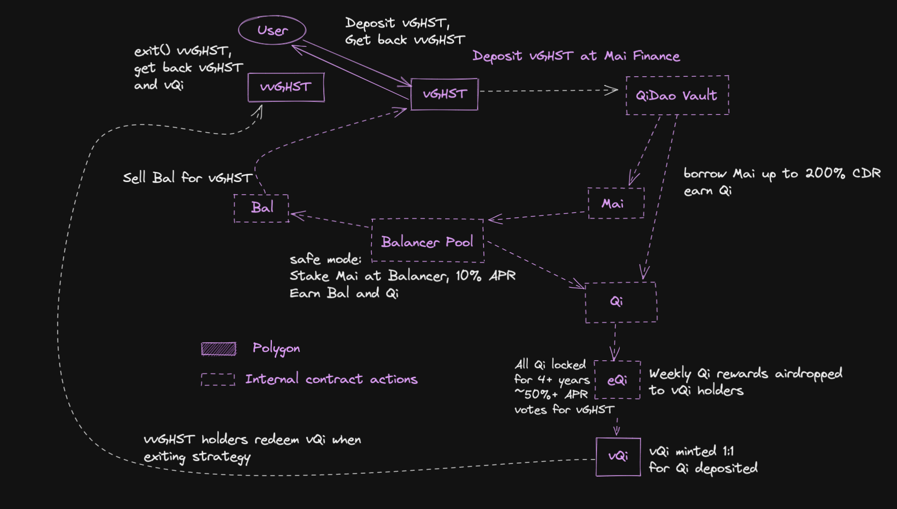

# vvGHST

**TL;DR: by leveraging the vGHST vault on QiDao and continuously investing a portion of the profits into buying liquidity for a Convex-style tokenized Qi token (vQi), we hope to create a “flywheel” of yield whereby we accumulate boosted Qi voting power (eQi) to vote for vGHST to increase profits.**

With vvGHST, we allow users to deposit their vGHST into the vvGHST smart contract, and the funds will collectively be managed to maximize yield in the vGHST QiDao vault. Users will deposit vGHST, and receive a vvGHST receipt token which can later be redeemed for vGHST + vQi (explained more below).

The smart contract will deposit vGHST, borrow Mai up to a maximum safe threshold (\~200%), and reinvest that Mai for additional yield. The current iteration of this strategy deposits the Mai on Balancer, earning \~ 10% APY. This results in the vvGHST contract earning increasingly larger amounts of Qi and Bal every week. This Qi will all be converted to vQi (see below), with the majority being held for depositors to withdraw when they exit the strategy. The contract will be constantly monitored (using either custom bots or Chainlink Keepers), and will be rebalanced if the collateral-debt threshold dips below the point where it earns rewards (160%). As such, the risk of liquidation is extremely minimal.

**Fees:**

We charge a 0.5% withdrawal fee if you exit the vvGHST contract.  This fee covers the 0.5% repayment fee charged by Qidao that is incurred by unwinding the strategy when you exit.

We also charge a 10% profit fee charged on the weekly profits (not on your collateral).  This fee goes towards increasing vQi liquidity and ensuring the Qi-vQi peg, covering the cost of custom bots to ensure the safety of the vvGHST vault, investing further in the protocol, and compensating the devs and vault managers for their time and commitment.
